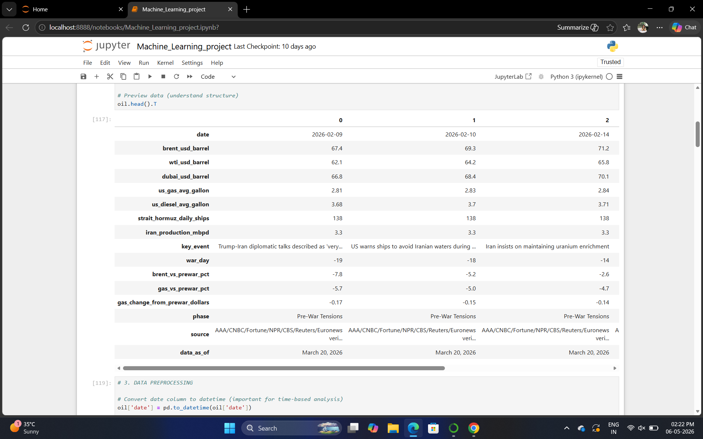
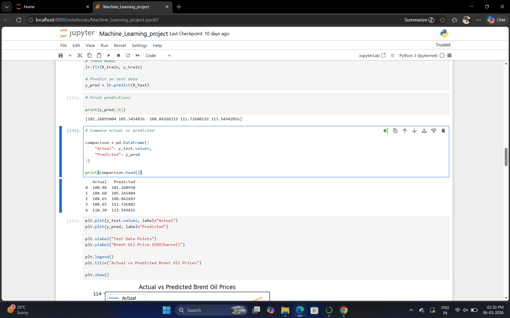

# Oil Price Prediction and Spike Analysis During the 2026 Iran War Using Machine Learning

## Project Overview

This project analyzes the impact of the 2026 Iran War on global oil prices using Machine Learning techniques.  
The system predicts Brent crude oil prices, detects sudden oil price spikes, and analyzes market behavior using regression, classification, clustering, and dimensionality reduction techniques.
The project also includes a Streamlit web application for interactive oil price prediction.

# Features
 Brent crude oil price prediction  
 Oil price spike detection  
 Feature engineering using lag price and rolling mean  
 Outlier handling using IQR  
 SMOTE for handling imbalanced data  
 PCA visualization  
 KMeans clustering for market behavior analysis  
 Hyperparameter tuning using GridSearchCV  
 Streamlit interactive web app 
 
# Machine Learning Models Used

# Regression Models
- Linear Regression
- Ridge Regression
- Lasso Regression
- Random Forest Regressor

# Classification Model
- Random Forest Classifier

# Clustering
- KMeans Clustering

 # Dataset Information
The dataset contains real-world geopolitical and oil market related information during the 2026 Iran War, including:

- Brent crude oil prices
- WTI crude oil prices
- Dubai crude oil prices
- US gas prices
- Strait of Hormuz shipping activity
- Iran oil production
- War timeline indicators
- Market volatility data

# Technologies Used

- Python
- - Pandas
- NumPy
- Matplotlib
- Scikit-learn
- Streamlit
- SMOTE

# Project Screenshots
# Dataset Preview


# Actual vs Predicted Comparison



# Actual vs Predicted Graph


---

## 🎯 Classification Metrics

### Accuracy, Precision, Recall, F1 Score


---

## 🌐 Streamlit Web Application


---

# 📊 Model Performance

## Regression Results
- R² Score: ~0.98
- RMSE: ~1.57

## Classification Results
- Accuracy: ~80%
- Precision: ~0.88
- Recall: ~0.86
- F1 Score: ~0.87

---

# ▶️ How to Run the Project

## 1️⃣ Clone Repository

```bash
git clone https://github.com/your-username/your-repository-name.git
